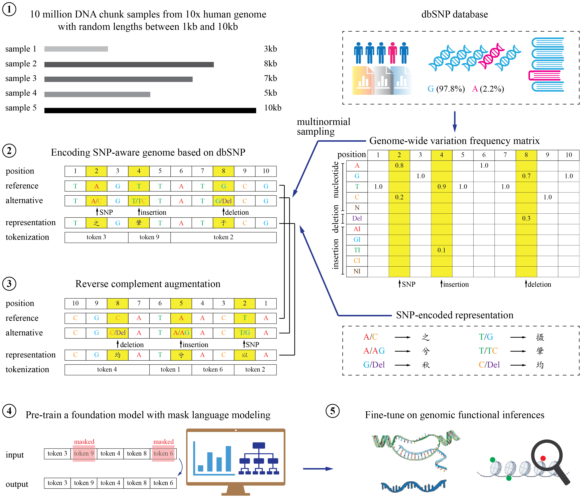

# biomed-multi-omic

Biomedical foundational models for omics data. This package supports the development of foundation models for scRNA or for DNA data.

`biomed-multi-omic` enables development and testing of foundation models for DNA sequences and for RNA expression,
with modular model and training methods for pretraining and fine-tuning, controllable via a declarative no-code interface.
`biomed-multi-omic` leverages anndata, HuggingFace Transformers, PyTorchLighting and Hydra.

- 🧬 A single package for DNA and RNA Foundation models. scRNA pretraining on h5ad files or TileDB (eg CellXGene), DNA pretraining on reference human genome (GRCh38/hg38) and also variant imputed genome based on common SNPs available from GWAT catalog and ClinVar datasets.
- 🚀 Leverages latest open source tools: anndata, HuggingFace transformers and PyTorchLighting
- 📈 Zero-shot and finetuning support for diverse downstream tasks: (cell type annotation, perturbation prediction for scRNA, promoter prediction task and regulatory regions using Massively parallel reporter assays (MPRAs)
for DNA sequences)
- Novel pretraining strategies for scRNA and DNA implemented alongside existing methods to enable experimentation and comparison.


## Installation

We recommend using [uv](https://github.com/astral-sh/uv) to create your environment due to it's 10-100x speed up over pip.

Install using cloned repo:

```sh
git clone git@github.com:BiomedSciAI/biomed-multi-omic.git
cd biomed-multi-omics
uv venv .venv -p3.12
source ./.venv/bin/activate
uv pip install -e .
```

NB - `biomed-multi-omic` depends on `hic-straw` which requires `curl`. You may need to install `curl` or `libcurl` , for more information please refer to `curl`'s install instructions for your OS.

### Optional dependencies

In addition to the base package there are additional optional dependencies which extends `biomed-multi-omic` capabilities further. These include:

- `bulk_rna`: Extends modules for extracting and preprocessing bulk RNA-seq data
- `benchmarking`: Installs additional models used benchmark `bmfm-mulit-omics` against. These include scib, scib-metrics, pyliger, scanorama and harmony-pytorch.
- `test`: Unittest suite which is recommended for development use

To install optional dependencies from this GitHub repository you can run from package root:

```sh
uv pip install ".[bulk_rna,benchmarking,test,notebook]"
```

## `bmfm-rna` checkpoints

The model's weights can be aquired from [IBM's HuggingFace collection](https://huggingface.co/ibm-research). The following scRNA models are avaliable:

- MLM+RDA: [ibm-research/biomed.rna.bert.110m.mlm.rda.v1](https://huggingface.co/ibm-research/biomed.rna.bert.110m.mlm.rda.v1)
- MLM+Multitask: [ibm-research/biomed.rna.bert.110m.mlm.multitask.v1](https://huggingface.co/ibm-research/biomed.rna.bert.110m.mlm.multitask.v1)
- WCED+Multitask: [ibm-research/biomed.rna.bert.110m.wced.multitask.v1](https://huggingface.co/ibm-research/biomed.rna.bert.110m.wced.multitask.v1)
- WCED 10 pct: [ibm-research/biomed.rna.bert.110m.wced.v1](https://huggingface.co/ibm-research/biomed.rna.bert.110m.wced.v1)

For details on how the models were trained, please refer to [the BMFM-RNA preprint](https://arxiv.org/abs/2506.14861).

To get embeddings and predictions for scRNA data run:

```bash
export MY_DATA_FILE=... # path to h5ad file with raw counts and gene symbols
bmfm-targets-run -cn predict input_file=$MY_DATA_FILE working_dir=/tmp checkpoint=ibm-research/biomed.rna.bert.110m.wced.multitask.v1
```

For more details tutorial see RNA tutorials. Note to use the notebook you will need to install the `notebook` optional dependencies (see [Installation](#installation)):

- To run inference programmatically, you can see a zero-shot example in this [scRNA zero-shot notebook](tutorials/RNA/1_zero_shot_using_yaml.ipynb).
- To inspect the resulting embeddings and cell-type predictions use this [scRNA inspect embeddings notebook](tutorials/RNA/2_inference_inspection.ipynb).

## `bmfm-dna` checkpoints

The model's weights can be aquired from IBM's HuggingFace collection. The following DNA models are avaliable:

- MLM+REF_GENOME: [ibm-research/biomed.dna.ref.modernbert.113m](https://huggingface.co/ibm-research/biomed.dna.ref.modernbert.113m.v1)
- MLM+REFSNP_GENOME: [ibm-research/biomed.dna.snp.modernbert.113m](https://huggingface.co/ibm-research/biomed.dna.snp.modernbert.113m.v1)

### DNA Inference

For details on how the models were trained, please refer to the [BMFM-DNA preprint](https://arxiv.org/abs/2507.05265).

To get embeddings for DNA sequences run:

```bash
export INPUT_DIRECTORY=... # path to your DNA sequences files
bmfm-targets-run -cn dna_predict input_directory=$INPUT_DIRECTORY working_dir=/tmp checkpoint=ibm-research/biomed.dna.snp.modernbert.113m.v1
```

For more details tutorial see DNA tutorials.

## Package Architecture

### RNA Modules

`bmfm-rna` framework diagram schematic shows the modules available for building  Transcriptomics Foundation Model (TFM).
A novel contribution of our work is the Whole Cell Expression Decoder (WCED), an innovative pretraining method aimed at improving transcriptomic foundation models.
In WCED, the model’s objective is to reconstruct a full cell expression profile from a partial input's `[CLS]` token representation generated by the transformer encoder.
By training models to autocomplete the expression profiles, WCED improves the model’s understanding of underlying biological processes, resulting in better generalization and more accurate predictions for downstream tasks.


### DNA Modules

The `bmfm-dna` framework addresses key limitations of existing DNA language models by incorporating natural genomic variations into the pre-training process, rather than relying solely on the reference genome. This allows the model to better capture critical biological properties, especially in regulatory regions where many disease-associated variants reside. As a result, `bmfm-dna` offers a more comprehensive and biologically meaningful representation, advancing the field beyond traditional DNALM strategies.

`bmfm-dna` framework diagram schematic shows the modules available for multiple strategies to encode natural genomic variations; multiple architectures such as BERT, Performer, ModernBERT to build genomic foundation models; fine-tuning and benchmarking of the foundation models on well-established biologically meaningful tasks. In particular, the package incorporates most of the benchmarking datasets from Genomic Understanding and Evaluation (GUE) package released in DNABERT-2. In addition, the package also supports promoter activity prediction on datasets created using Massive Parallel Reporting Assays (MPRA), and SNP-disease association prediction.




For more details, check out the [the BMFM-DNA preprint](https://www.arxiv.org/abs/2507.05265).

## Citation

To cite the tool for both RNA and DNA, please cite both the following articles:

```bibtex
@misc{dandala2025bmfmrnaopenframeworkbuilding,
      title={BMFM-RNA: An Open Framework for Building and Evaluating Transcriptomic Foundation Models},
      author={Bharath Dandala and Michael M. Danziger and Ella Barkan and Tanwi Biswas and Viatcheslav Gurev and Jianying Hu and Matthew Madgwick and Akira Koseki and Tal Kozlovski and Michal Rosen-Zvi and Yishai Shimoni and Ching-Huei Tsou},
      year={2025},
      eprint={2506.14861},
      archivePrefix={arXiv},
      primaryClass={q-bio.GN},
      url={https://arxiv.org/abs/2506.14861},
}

@misc{li2025bmfmdnasnpawarednafoundation,
      title={BMFM-DNA: A SNP-aware DNA foundation model to capture variant effects},
      author={Hongyang Li and Sanjoy Dey and Bum Chul Kwon and Michael Danziger and Michal Rosen-Tzvi and Jianying Hu and James Kozloski and Ching-Huei Tsou and Bharath Dandala and Pablo Meyer},
      year={2025},
      eprint={2507.05265},
      archivePrefix={arXiv},
      primaryClass={q-bio.GN},
      url={https://arxiv.org/abs/2507.05265},
}
```
