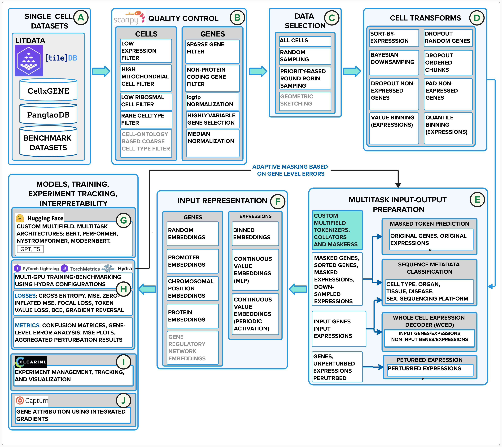

# biomed-multi-omic

Biomedical foundational models for omics data.
This package supports the development of foundation models for scRNA or for DNA data.
For details see the preprints:

- BMFM-RNA: An Open Framework for Building and Evaluating Transcriptomic Foundation Models, Bharath Dandala, Michael M. Danziger, Ella Barkan, Tanwi Biswas, Viatcheslav Gurev, Jianying Hu, Matthew Madgwick, Akira Koseki, Tal Kozlovski, Michal Rosen-Zvi, Yishai Shimoni, Ching-Huei Tsou, [arXiv:2506.14861](https://arxiv.org/abs/2506.14861)
- DNA preprint to be released soon

## Install

```sh
# Clone the repository
git clone git@github.com:BiomedSciAI/biomed-multi-omic.git

# Change directory to the root of the cloned repository
cd biomed-multi-omics
# recommended venv setup (vanilla pip and conda also work)
uv venv .venv -p3.12
source ./.venv/bin/activate
uv pip install -e .
```

## Example usage

To get scRNA embeddings and zero shot cell-type predictions:

```bash
export MY_DATA_FILE=... # path to h5ad file with raw counts and gene symbols
bmfm-targets-run -cn predict input_file=$MY_DATA_FILE working_dir=/tmp checkpoint=ibm-research/biomed.rna.bert.110m.wced.multitask.v1
```

For more options see [run](./run/README.md).

## Checkpoints

### scRNA

- MLM+RDA [ibm-research/biomed.rna.bert.110m.mlm.rda.v1](https://huggingface.co/ibm-research/biomed.rna.bert.110m.mlm.rda.v1)
- MLM+Multitask [ibm-research/biomed.rna.bert.110m.mlm.multitask.v1](https://huggingface.co/ibm-research/biomed.rna.bert.110m.mlm.multitask.v1)
- WCED+Multitask [ibm-research/biomed.rna.bert.110m.wced.multitask.v1](https://huggingface.co/ibm-research/biomed.rna.bert.110m.wced.multitask.v1)
- WCED 10 pct [ibm-research/biomed.rna.bert.110m.wced.v1](https://huggingface.co/ibm-research/biomed.rna.bert.110m.wced.v1)

For details on how the models were trained, please refer to [the BMFM-RNA preprint](https://arxiv.org/abs/2506.14861).

## RNA processing overview


For more details, check out the [the BMFM-RNA preprint](https://arxiv.org/abs/2506.14861)..

## Credits

This project was created in IBM Research.
